# Django-Job-Finder

#### Job-Finder Built Using :

1. Django
2. Sqlite
3. DjangoRestFrameWork
4. DjangoBootstrap4

### Features:

1. add A Jobs For Authenticated Users.
2. Job List For Display All Jobs and Filtering Results.
3. JobDetail With Apply Form For Specific Job.
4. Contactus And Sending Message To Email
5. BlogList For Display All Posts By users
6. Authenticated Users Also Can Create Posts 
7. Single Blog Page With comment Form for Authenticated Users
8. ProfileInformation And Profile-Edit 
9. Class Based Views API With Function Based Views API For All Applications
10. Login--Logout and Register--ResetPass

### Screenshots From The Project

## Home page

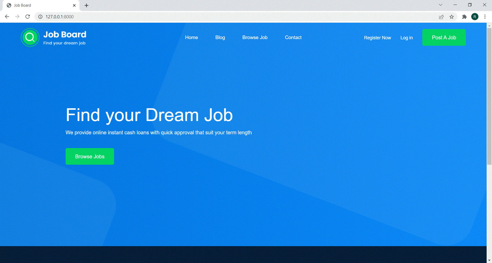

## Login page

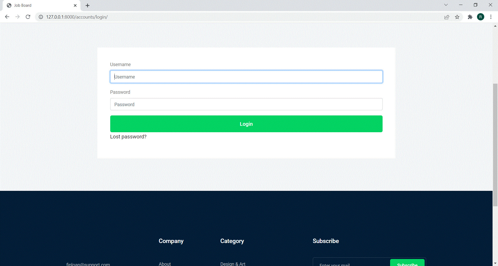

## Jobs List With A Filter

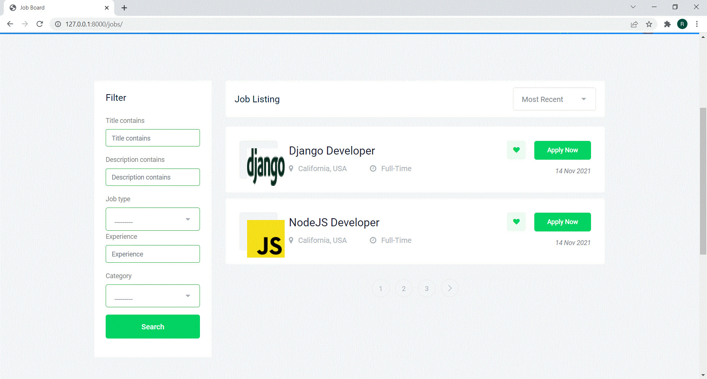

## Job details 
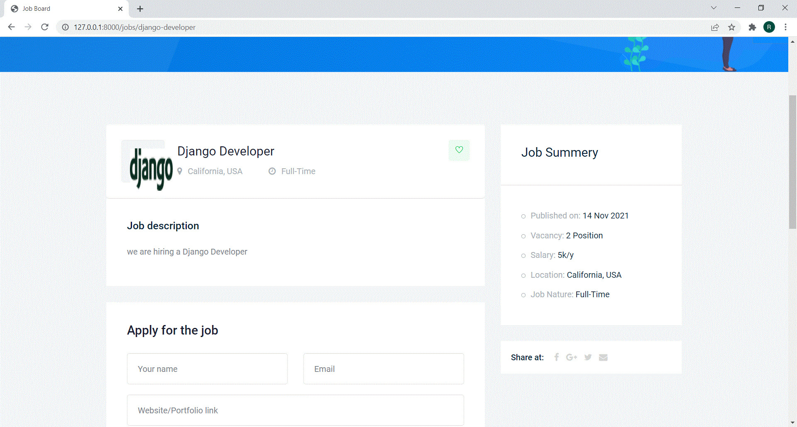

## Job details With Apply Form

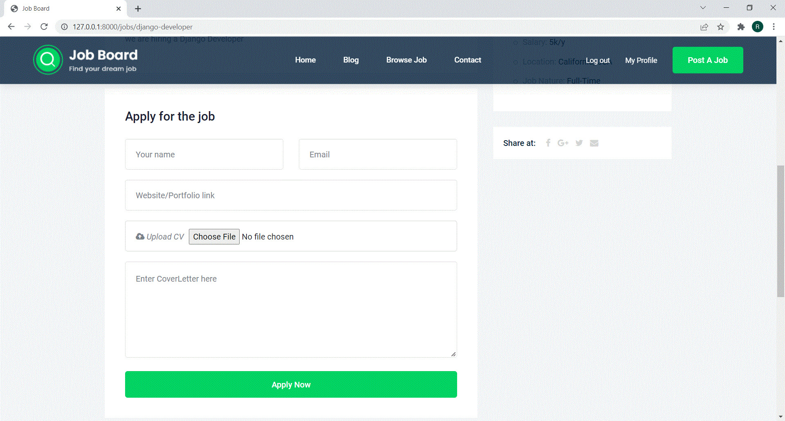

## Add new Job

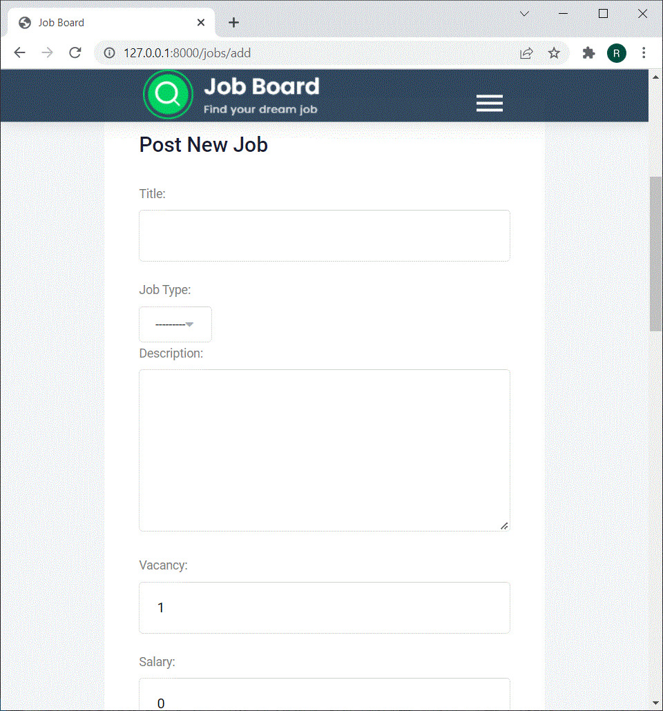

## Blogs List With Create Posts

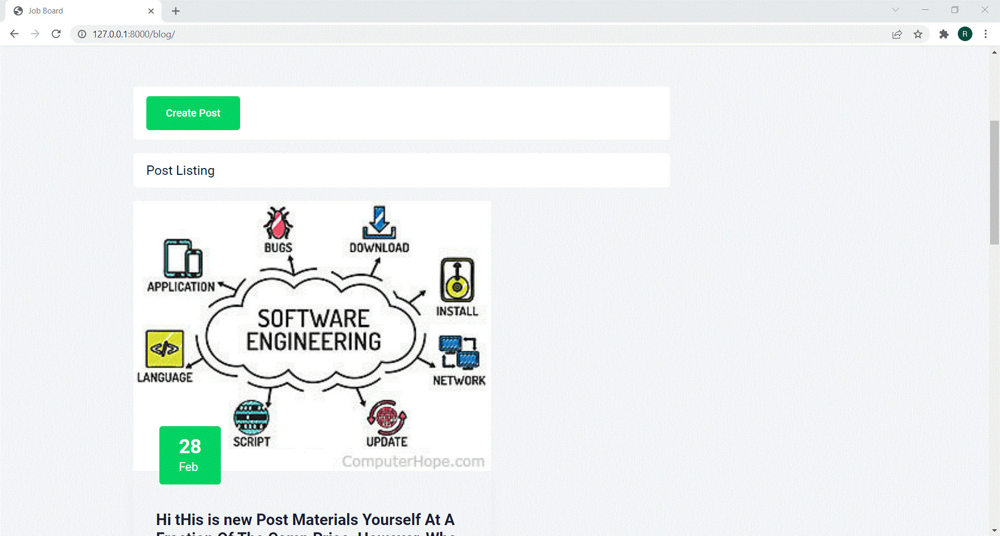
 

## Blogs List

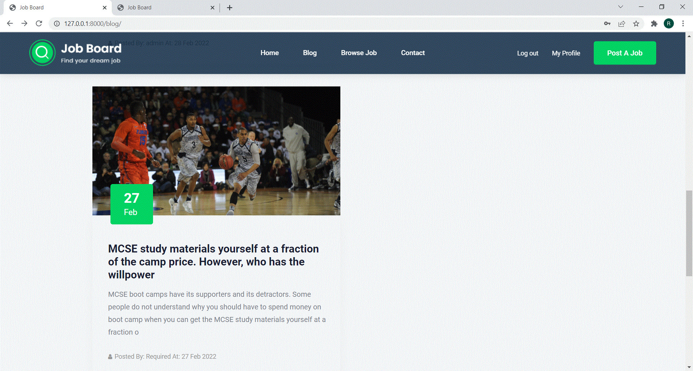

## Blog detail With Comment Form

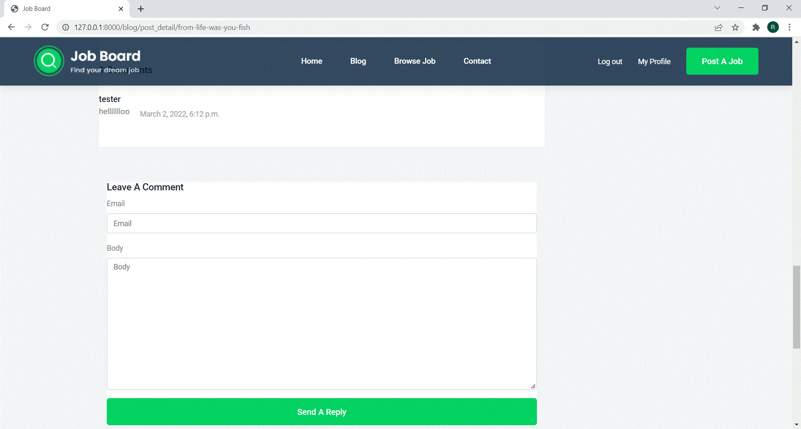

## Login

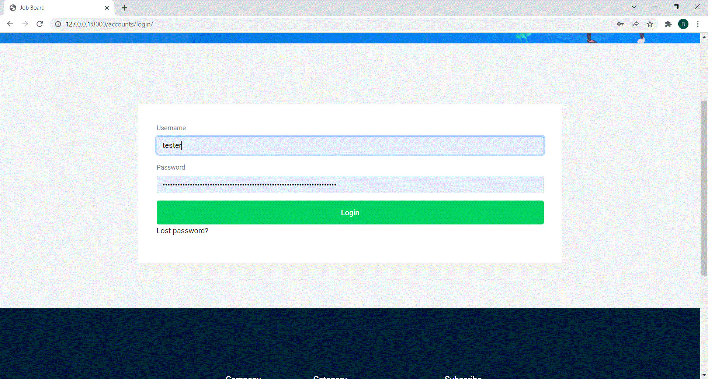

## ResetPass

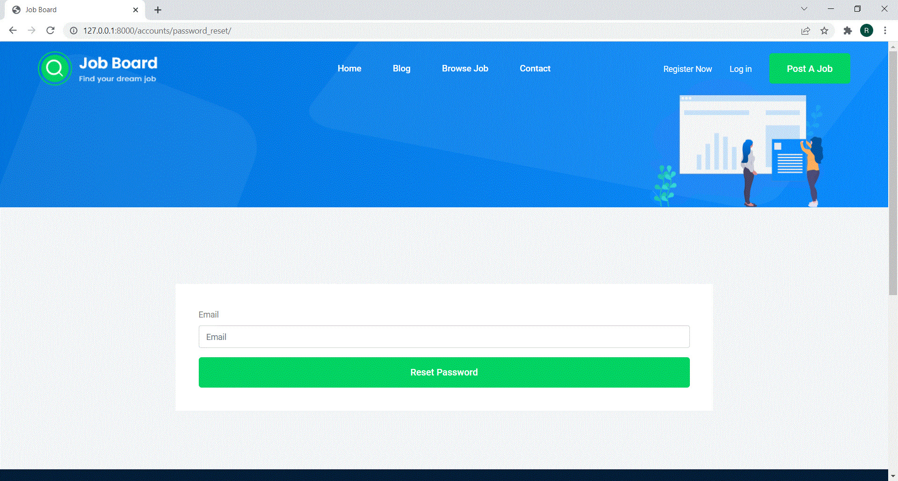

## Registeration

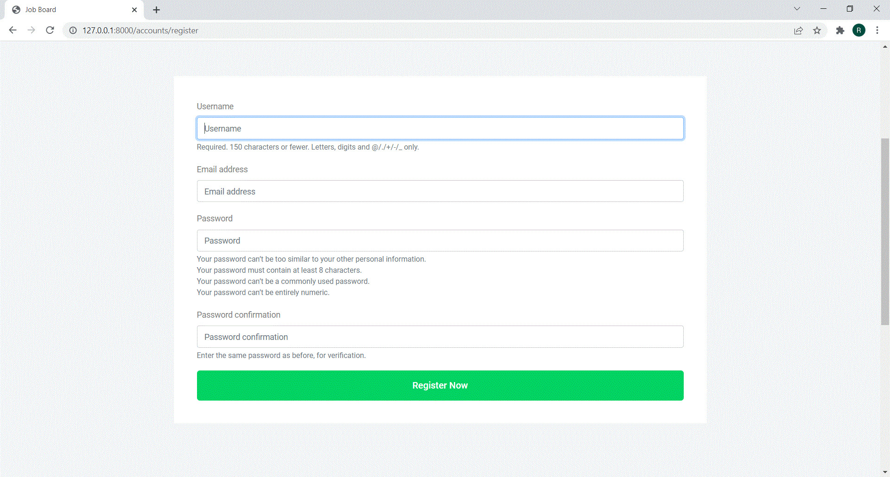

## ProfileSummary

## EditProfile

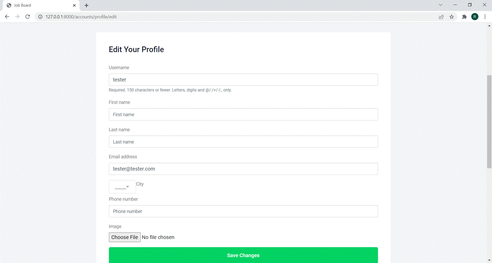

## Contactus

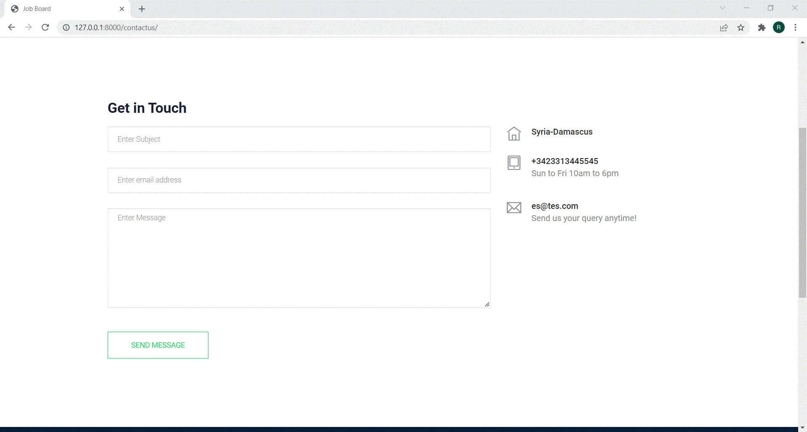

## API

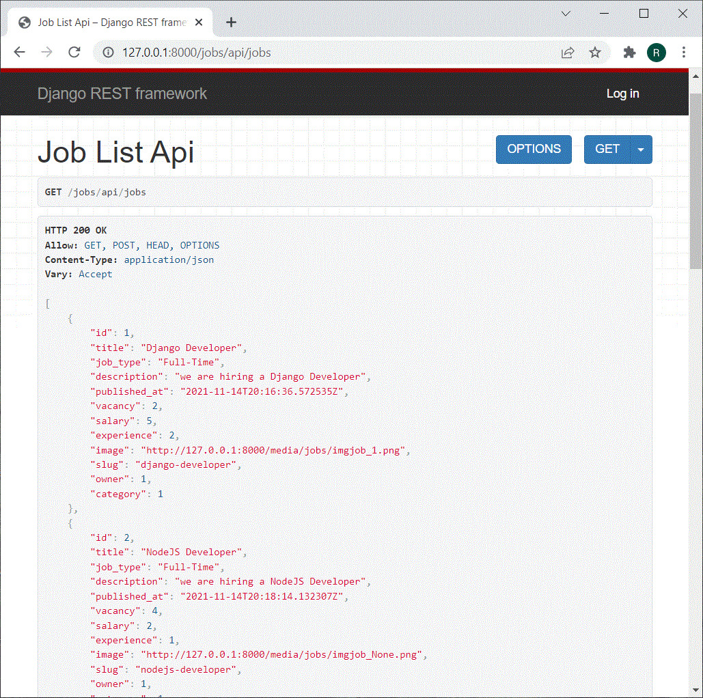

 

Show your support by 🌟 the project!!
