# Django-Job-Finder

#### Job-Finder Built Using :

1. Django
2. Sqlite
3. DjangoRestFrameWork
4. DjangoBootstrap4

### Features:

1. add A Jobs For Authenticated Users.
2. Job List For Display All Jobs and Filtering Results.
3. JobDetail With Apply Form For Specific Job.
4. Contactus And Sending Message To Email
5. BlogList For Display All Posts By users
6. Authenticated Users Also Can Create Posts 
7. Single Blog Page With comment Form for Authenticated Users
8. ProfileInformation And Profile-Edit 
9. Class Based Views API With Function Based Views API For All Applications
10. Login--Logout and Register--ResetPass

### Screenshots From The Project

## Home page

![alt text]

## Login page

![alt text]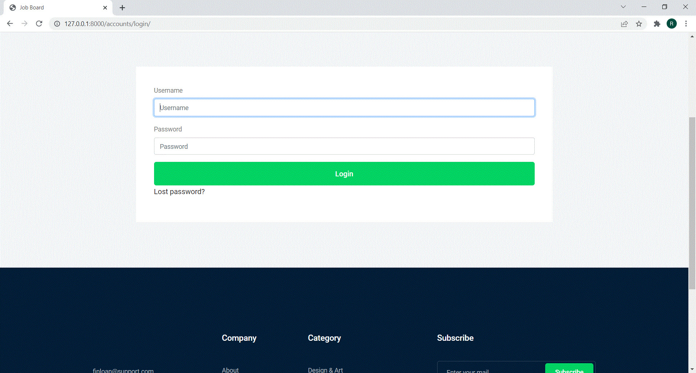

## Jobs List With A Filter

![alt text]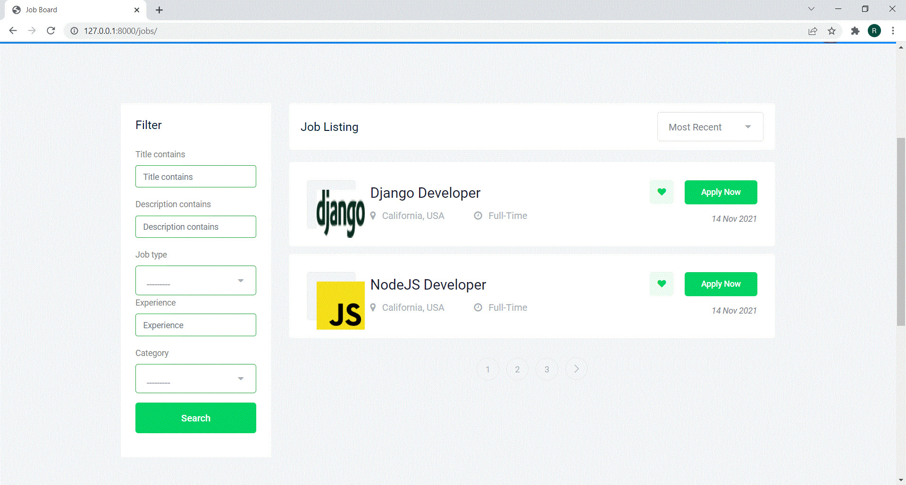

## Job details 
![alt text]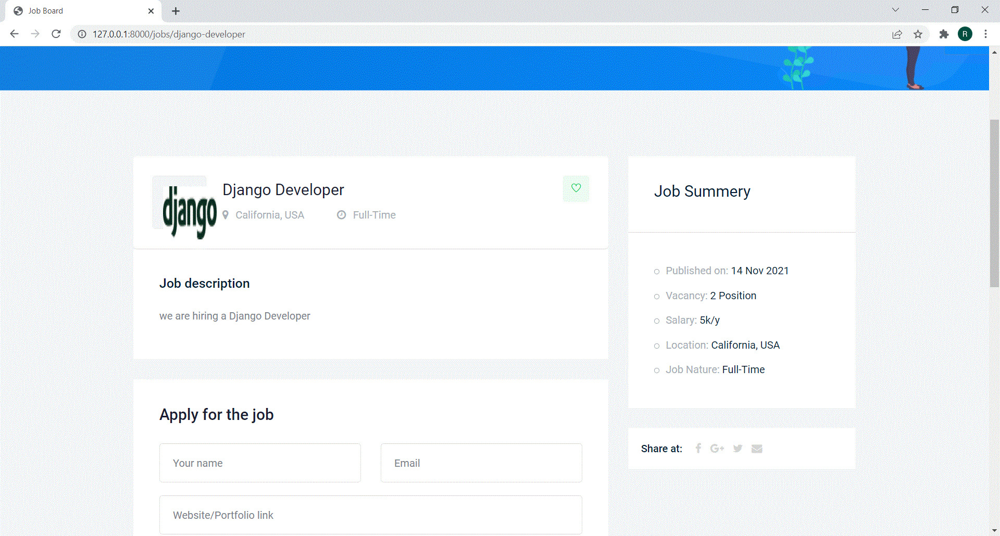

## Job details With Apply Form

![alt text]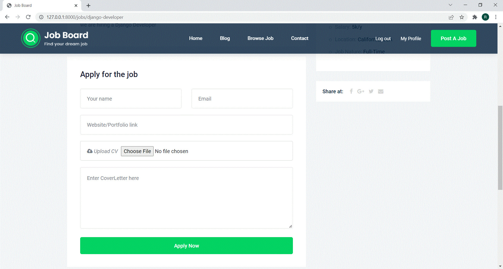

## Add new Job

![alt text]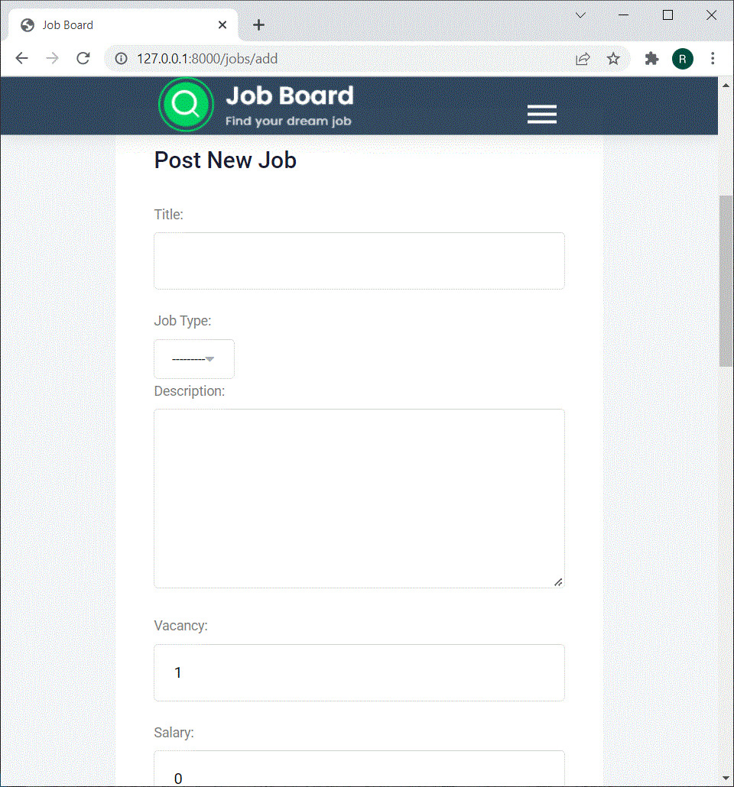

## Blogs List With Create Posts

![alt text]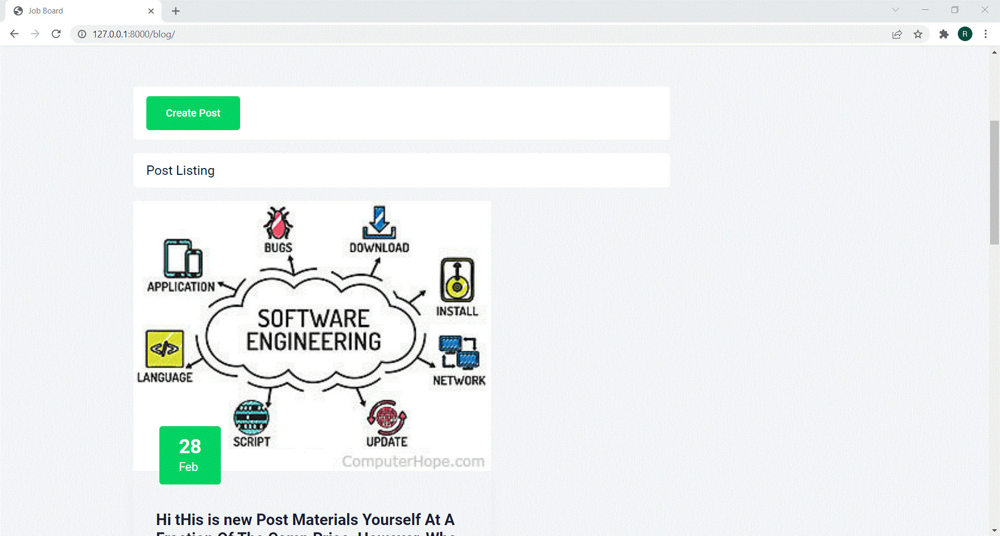
 

## Blogs List

![alt text]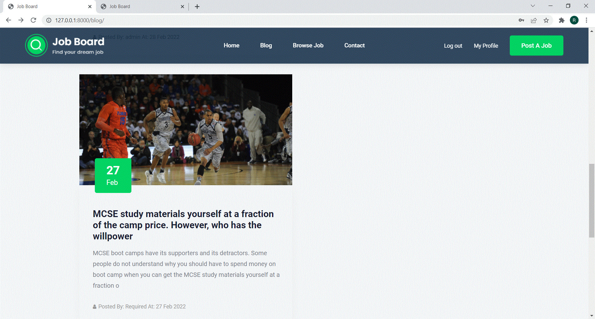

## Blog detail With Comment Form

![alt text]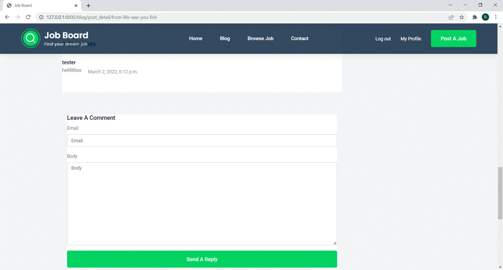

## Login

![alt text]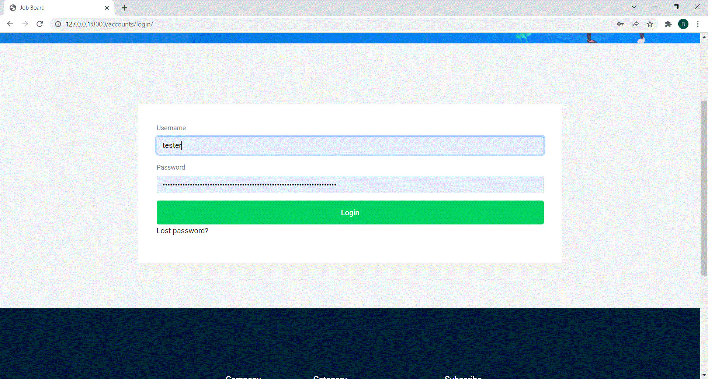

## ResetPass

![alt text]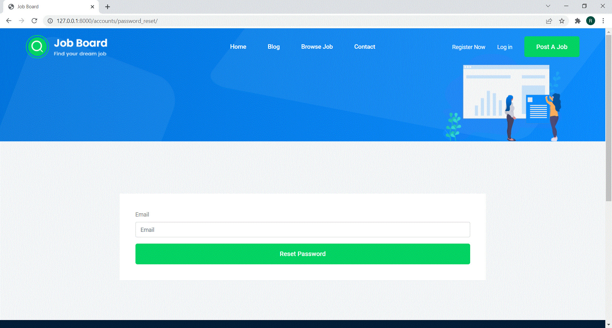

## Registeration

![alt text]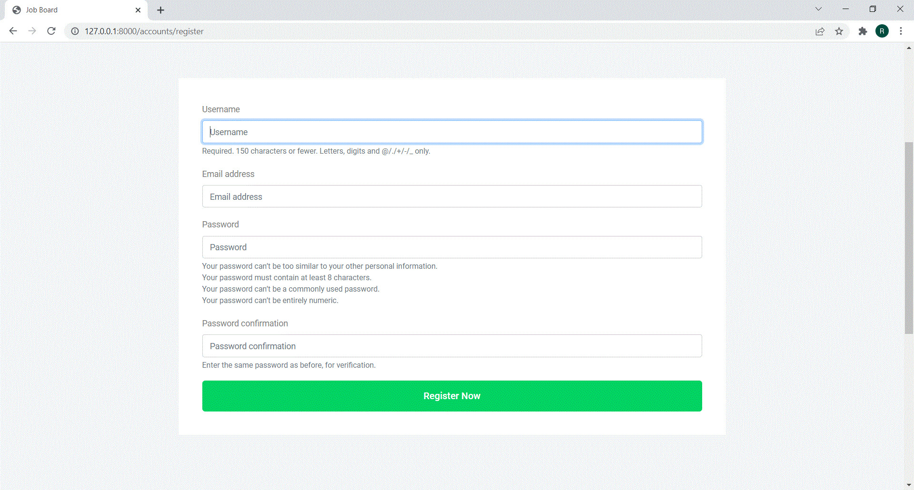

## ProfileSummary

![alt text]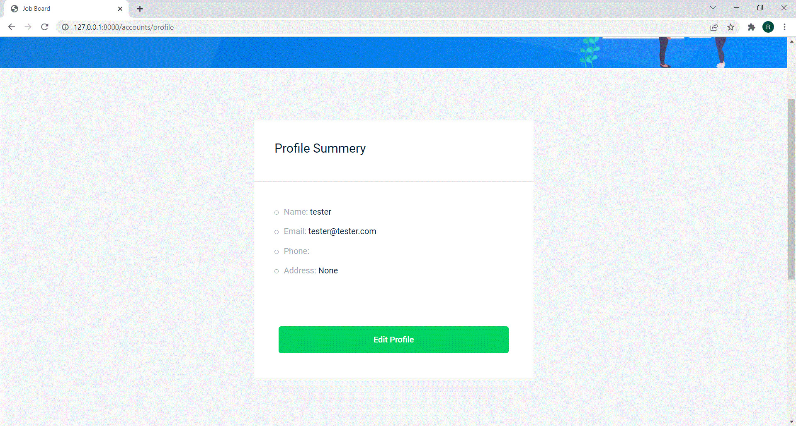

## EditProfile

![alt text]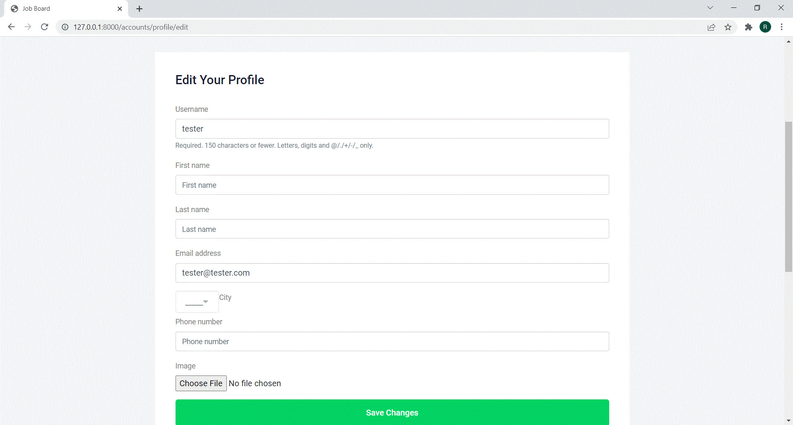

## Contactus

![alt text]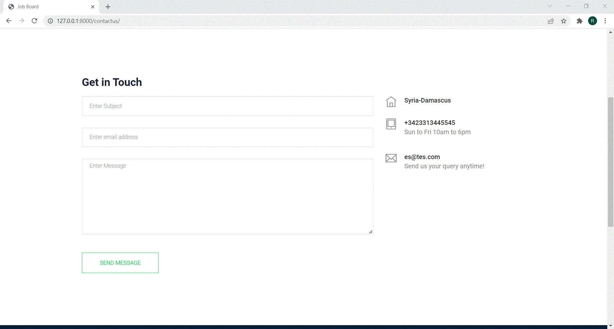

## API

![alt text]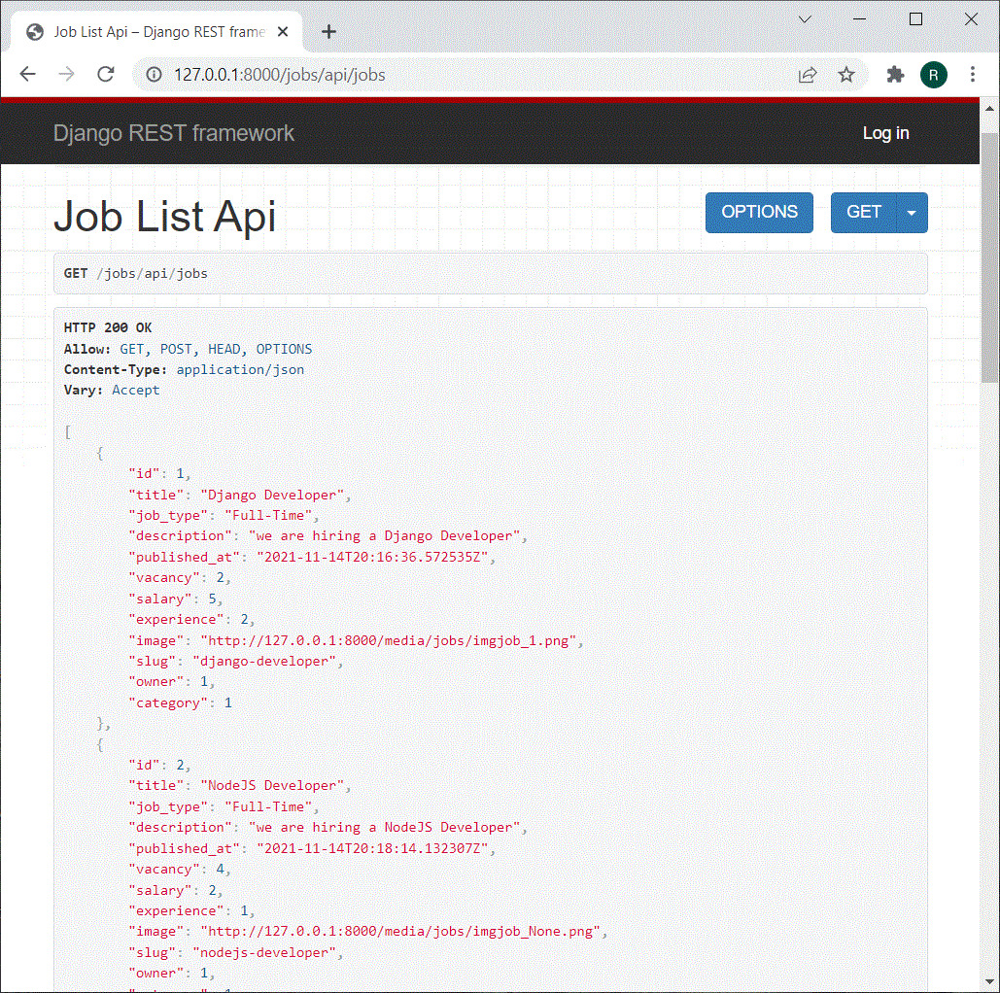

 

Show your support by 🌟 the project!!
